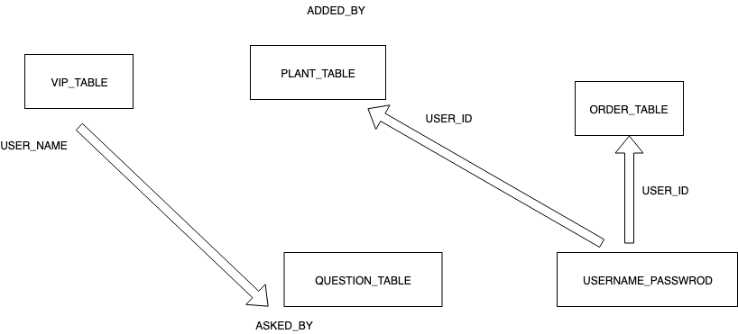

# Website proposal for MCS-205
#### _Aim: To make a E-Commerce website from scratch as a part of academic assignment_
#### _By : Abhinav_
## Name : [PeaceLily.ml](http://PeaceLily.ml)
## Refering 
## _[NurseryLive](https://NurseryLive.com), [Amazon India](https://www.amazon.in/Plants/b?ie=UTF8&node=4297302031)_
## Main theme for [PeaceLily.ml](http://PeaceLily.ml):
* To sell plants, with and without pots.
* To sell pots, containers, used wine and whisky bottles, pebbles.
* To sell manure and fertilizers like NPK 20-20-20.
* To provide a demographic sepcific plant recommendation for a more loyal customer base build-up.
* To provide a notifications about new stocks etc.
## Vision
> From my perspective mainstream plants website lacks in
* To have a discussion corner, with no sign-up required(but with ads, for premium customers it's ad free), to attract more traffic on the website(as most of the plants lovers get obsessed with plants just by looking at them, increases the chance of purchase).
* To have an inter customer messaging portal for premium members for fast and easy query processing. 
* To provide decorative materials corner for plants, such as *empty whisky bottles 🍾*, pebbles etc for purchased plants.
* To provide a list of plants and season specific nutrition chart of purchased plants or seeds.
* To provide a share guide along with the purchased plants.
## Types Of accounts on PeaceLily.ml
> More features in premium than regular and check-out.
1. Premium account
2. Regular account
3. Check-Out account
## Framework and Technologies to be used
* Server-Side : PHP(generate dynamic page content, sends and receives cookies, well documented and tested code readily  available)
* Proper session management to provide hastle free experience for the seller and VIP users on the website.
* ~~For UI - Bootstrap(ease of use, well documented code readily available)~~

## Security measures 
* This site has HTTPS.
* Runs through tunneling provided through cloudfare.

## Tables relation

